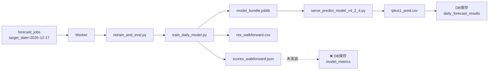
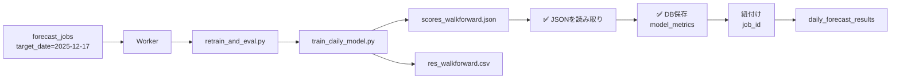

# モデル精度指標の調査レポート

**調査日**: 2025-12-18  
**調査者**: AI Assistant  
**目的**: 学習済みモデルの精度指標（MAE/R2等）の計算場所と出力形式を特定し、DB保存の実装方針を策定

---

## エグゼクティブサマリー

### 結論

✅ **精度指標は既に計算され、JSONファイルに出力されている**

- **ファイル名**: `scores_walkforward.json`
- **場所**: `{out_dir}/scores_walkforward.json`（例：`/tmp/forecast_jobs/{job_id}/out/scores_walkforward.json`）
- **計算場所**: [train_daily_model.py#L773-L776](../../app/backend/inbound_forecast_worker/scripts/train_daily_model.py#L773-L776)
- **指標**: R2_total, MAE_total, R2_sum_only, MAE_sum_only, n_days, config

### 推奨アクション

**方針A（推奨）**: 既存のJSONファイルを読み取ってDB保存
- メリット：学習本体への改修不要、最小差分で実装可能
- デメリット：出力形式変更に弱い（ただし当面は安定）

---

## 1. 精度指標の計算場所

### 1.1 train_daily_model.py

**ファイル**: [app/backend/inbound_forecast_worker/scripts/train_daily_model.py](../../app/backend/inbound_forecast_worker/scripts/train_daily_model.py)

#### インポート（行42）
```python
from sklearn.metrics import r2_score, mean_absolute_error
```

#### MAE関数の定義（行91-95）
```python
def _mae(y, yhat):
    y, yhat = np.asarray(y), np.asarray(yhat)
    m = np.isfinite(y) & np.isfinite(yhat)
    return float(np.mean(np.abs(y[m] - yhat[m]))) if m.sum() else float("nan")
```

#### Walk-forward評価の実行（行770-783）

**場所**: [train_daily_model.py#L770-L783](../../app/backend/inbound_forecast_worker/scripts/train_daily_model.py#L770-L783)

```python
df_res = pd.DataFrame(results).set_index("date").sort_index()
ys = df_res["y_true"].values; ps = df_res["total_pred"].values; ss = df_res["sum_items_pred"].values
scores = {
    "R2_total": float(r2_score(ys, ps)), 
    "MAE_total": float(mean_absolute_error(ys, ps)),
    "R2_sum_only": float(r2_score(ys, ss)), 
    "MAE_sum_only": float(mean_absolute_error(ys, ss)),
    "n_days": int(len(df_res)),
    "config": asdict(cfg)
}

# ---- Save results ----
df_res.to_csv(os.path.join(out_dir, "res_walkforward.csv"), encoding="utf-8-sig")
with open(os.path.join(out_dir, "scores_walkforward.json"), "w", encoding="utf-8") as f:
    json.dump(scores, f, ensure_ascii=False, indent=2)
```

**計算内容**:
1. `y_true`（実績値）と `total_pred`（予測値）を取得
2. `R2_total`: 全体のR²スコア（`total_pred` vs `y_true`）
3. `MAE_total`: 全体のMAE（`total_pred` vs `y_true`）
4. `R2_sum_only`: 品目合計のR²スコア（`sum_items_pred` vs `y_true`）
5. `MAE_sum_only`: 品目合計のMAE（`sum_items_pred` vs `y_true`）
6. `n_days`: 評価日数
7. `config`: 学習ハイパーパラメータ（top_n, time_decay等）

---

## 2. 出力ファイル形式

### 2.1 scores_walkforward.json

**場所**: `{out_dir}/scores_walkforward.json`

**実例**（2025-12-17の予測ジョブ）:
```json
{
  "R2_total": 0.605459684339531,
  "MAE_total": 13.561578698735554,
  "R2_sum_only": -0.5323532115540415,
  "MAE_sum_only": 33.51782244544084,
  "n_days": 245,
  "config": {
    "top_n": 6,
    "min_stage1_days": 120,
    "min_stage2_rows": 28,
    "use_same_day_info": true,
    "max_history_days": 600,
    "time_decay": "linear",
    "calibration_window_days": 28,
    "calibration_window_days_tuesday": 56,
    "zero_cap_quantile": 0.15,
    "share_oof_models": 2,
    "random_state": 42
  }
}
```

**フィールド定義**:

| フィールド | 型 | 意味 | 単位 |
|-----------|----|----|------|
| `R2_total` | float | 全体のR²スコア（決定係数） | 無次元（-∞～1） |
| `MAE_total` | float | 全体の平均絶対誤差 | ton |
| `R2_sum_only` | float | 品目合計のみのR²スコア | 無次元（-∞～1） |
| `MAE_sum_only` | float | 品目合計のみのMAE | ton |
| `n_days` | int | Walk-forward評価の日数 | 日 |
| `config` | object | 学習ハイパーパラメータ | - |

### 2.2 res_walkforward.csv

**場所**: `{out_dir}/res_walkforward.csv`

**カラム構成**:
- `date`: 評価日（YYYY-MM-DD）
- `y_true`: 実績値（ton）
- `sum_items_pred`: 品目合計予測値（ton）
- `total_pred`: 最終予測値（品目合計＋補正後、ton）

**サンプル**:
```csv
date,y_true,sum_items_pred,total_pred
2025-04-16,102.14,62.1478233993043,62.1478233993043
2025-04-17,97.86,58.10515844326329,58.10515844326329
2025-04-18,74.55,64.6577748141606,64.6577748141606
```

**用途**:
- Walk-forward評価の詳細結果
- R2/MAEの算出元データ
- エラー分析・可視化

---

## 3. 実行フロー

### 3.1 現状のフロー（2025-12-17の例）



**現状の課題**:
- ✅ 精度指標はJSONファイルに出力される
- ❌ **DBには保存されていない**
- ❌ 予測結果（`daily_forecast_results`）と精度指標が紐付いていない

### 3.2 改善後のフロー（実装目標）



---

## 4. 追加で計算可能な指標

### 4.1 既存データから追加計算可能

`res_walkforward.csv` から以下を追加計算可能：

| 指標 | 計算式 | 意味 |
|------|-------|------|
| **RMSE** | `sqrt(mean((y_pred - y_true)^2))` | 二乗平均平方根誤差 |
| **MAPE** | `mean(abs((y_true - y_pred) / y_true)) * 100` | 平均絶対パーセント誤差（%） |
| **Bias** | `mean(y_pred - y_true)` | バイアス（過大/過小推定） |
| **Max Error** | `max(abs(y_pred - y_true))` | 最大誤差 |

**実装例**:
```python
import pandas as pd
import numpy as np

df = pd.read_csv("res_walkforward.csv")
y_true = df["y_true"].values
y_pred = df["total_pred"].values

rmse = np.sqrt(np.mean((y_pred - y_true) ** 2))
mape = np.mean(np.abs((y_true - y_pred) / y_true)) * 100  # ゼロ除算注意
bias = np.mean(y_pred - y_true)
max_error = np.max(np.abs(y_pred - y_true))
```

### 4.2 R2の解釈と注意点

**R²スコアの特性**:
- 範囲: -∞ ～ 1
- 1: 完璧な予測
- 0: 平均値を予測するのと同等
- 負: 平均値より悪い予測

**本調査での実例**:
- `R2_total`: **0.605** → 60.5%の分散を説明（良好）
- `R2_sum_only`: **-0.532** → 品目合計だけでは不十分（補正が必要）

⚠️ **重要**: R2が負の値になることは異常ではない。評価データの分散が小さい場合や、モデルが平均値より悪い予測をする場合に発生する。

---

## 5. DB設計の推奨事項

### 5.1 テーブル設計（最小構成）

```sql
CREATE TABLE forecast.model_metrics (
    id UUID PRIMARY KEY DEFAULT gen_random_uuid(),
    job_id UUID NULL,  -- forecast_jobs.id への参照
    model_name TEXT NOT NULL,  -- 例: 'daily_tplus1'
    model_version TEXT NULL,  -- 例: 'v20251218' or bundle hash
    
    -- 学習期間
    train_window_start DATE NOT NULL,
    train_window_end DATE NOT NULL,
    eval_method TEXT NOT NULL,  -- 例: 'walkforward'
    
    -- 精度指標（コア）
    mae NUMERIC(18, 6) NOT NULL,
    r2 NUMERIC(18, 6) NOT NULL,
    n_samples INT NOT NULL,
    
    -- 精度指標（追加）
    rmse NUMERIC(18, 6) NULL,
    mape NUMERIC(18, 6) NULL,
    mae_sum_only NUMERIC(18, 6) NULL,
    r2_sum_only NUMERIC(18, 6) NULL,
    
    -- メタデータ
    unit TEXT NOT NULL DEFAULT 'ton',
    metadata JSONB NOT NULL DEFAULT '{}',  -- ハイパーパラメータ、特徴量数等
    
    -- 監査列
    created_at TIMESTAMPTZ NOT NULL DEFAULT NOW(),
    updated_at TIMESTAMPTZ NOT NULL DEFAULT NOW(),
    
    CONSTRAINT fk_model_metrics_job_id 
        FOREIGN KEY (job_id) 
        REFERENCES forecast.forecast_jobs(id) 
        ON DELETE CASCADE
);

CREATE INDEX idx_model_metrics_job_id ON forecast.model_metrics(job_id);
CREATE INDEX idx_model_metrics_model_name_version 
    ON forecast.model_metrics(model_name, model_version, train_window_end DESC);
```

### 5.2 データマッピング

| JSONフィールド | DBカラム | 変換 |
|---------------|---------|------|
| `MAE_total` | `mae` | そのまま |
| `R2_total` | `r2` | そのまま |
| `n_days` | `n_samples` | そのまま |
| `MAE_sum_only` | `mae_sum_only` | そのまま |
| `R2_sum_only` | `r2_sum_only` | そのまま |
| `config` | `metadata` | JSONBに変換 |
| - | `unit` | 固定値 'ton' |
| - | `model_name` | 固定値 'daily_tplus1' |
| - | `eval_method` | 固定値 'walkforward' |

---

## 6. 実装方針

### 6.1 方針A：既存JSONを読み取り（推奨）

**メリット**:
- 学習本体（`train_daily_model.py`）への改修不要
- 最小差分で実装可能
- 既存の出力形式を活用

**デメリット**:
- JSON形式の変更に弱い
- ファイルIOに依存

**実装箇所**:
```python
# app/backend/inbound_forecast_worker/app/application/run_daily_tplus1_forecast_with_training.py

def execute(self, target_date: date, job_id: UUID) -> None:
    # ... 既存の学習・予測処理 ...
    
    # 新規追加：精度指標をDBに保存
    scores_path = workspace / "out" / "scores_walkforward.json"
    if scores_path.exists():
        with open(scores_path, "r") as f:
            scores = json.load(f)
        
        self._model_metrics_repo.save_metrics(
            job_id=job_id,
            model_name="daily_tplus1",
            model_version=None,  # 将来的にbundle hashを使用
            train_window_start=actuals_start,
            train_window_end=actuals_end,
            eval_method="walkforward",
            mae=scores["MAE_total"],
            r2=scores["R2_total"],
            n_samples=scores["n_days"],
            mae_sum_only=scores.get("MAE_sum_only"),
            r2_sum_only=scores.get("R2_sum_only"),
            unit="ton",
            metadata=scores.get("config", {})
        )
```

### 6.2 方針B：学習処理内でメトリクスを返す（将来対応）

**実装例**:
```python
# train_daily_model.py を改修して返り値を追加
def run_walkforward(...) -> Tuple[Dict, Dict]:
    # ... 既存処理 ...
    return bundle, scores  # scoresを返す

# retrain_and_eval.py で受け取り
bundle, scores = run_walkforward(...)

# scores を JSON に加えて標準出力にも出力
print(f"METRICS: {json.dumps(scores)}")
```

**メリット**:
- ファイルIOに依存しない
- より厳密な契約

**デメリット**:
- 学習本体への改修が必要
- リスクが高い

**結論**: まず方針Aで実装し、Phase 2で方針Bへ移行を検討

---

## 7. データ契約

### 7.1 scores_walkforward.jsonの契約

**必須フィールド**:
```typescript
interface ScoresWalkforward {
  R2_total: number;       // -∞ ～ 1
  MAE_total: number;      // >= 0, 単位: ton
  R2_sum_only: number;    // -∞ ～ 1
  MAE_sum_only: number;   // >= 0, 単位: ton
  n_days: number;         // >= 1, 整数
  config: {
    top_n: number;
    time_decay: string;
    // ... その他のハイパーパラメータ
  };
}
```

**バリデーション**:
- `MAE_total >= 0`
- `n_days >= 1`
- `R2_total`, `R2_sum_only` はNaN/Infチェック

### 7.2 res_walkforward.csvの契約

**必須カラム**:
- `date`: YYYY-MM-DD形式
- `y_true`: 実績値（ton）
- `sum_items_pred`: 品目合計予測値（ton）
- `total_pred`: 最終予測値（ton）

**制約**:
- 行数 = `n_days`
- `y_true`, `total_pred` は非NULL

---

## 8. テストケース

### 8.1 単体テスト

```python
def test_parse_scores_json():
    scores = {
        "R2_total": 0.605,
        "MAE_total": 13.56,
        "n_days": 245,
        "config": {"top_n": 6}
    }
    
    metrics = parse_scores_to_metrics(scores)
    assert metrics.mae == 13.56
    assert metrics.r2 == 0.605
    assert metrics.n_samples == 245
```

### 8.2 統合テスト

```python
def test_save_metrics_to_db(db_session):
    job_id = UUID("...")
    
    repo = PostgreSQLModelMetricsRepository(db_session)
    metrics_id = repo.save_metrics(
        job_id=job_id,
        model_name="daily_tplus1",
        mae=13.56,
        r2=0.605,
        n_samples=245,
        ...
    )
    
    # 取得確認
    saved = repo.get_by_id(metrics_id)
    assert saved.mae == 13.56
```

---

## 9. アクションアイテム

### Phase 1：最小実装（今回）

1. [x] 調査レポート作成（本ドキュメント）
2. [ ] Alembicマイグレーション（`forecast.model_metrics`テーブル追加）
3. [ ] Port/Adapter実装
   - `ModelMetricsRepositoryPort`
   - `PostgreSQLModelMetricsRepository`
4. [ ] UseCase拡張
   - `RunDailyTplus1ForecastWithTrainingUseCase` に保存処理追加
5. [ ] E2E確認

### Phase 2：拡張（将来）

6. [ ] 学習処理からの直接返却（方針B）
7. [ ] RMSE/MAPE等の追加指標計算
8. [ ] モデルバージョン管理（bundle hash利用）
9. [ ] API追加（精度指標の取得エンドポイント）

---

## 10. 参考資料

### 10.1 関連ファイル

- [train_daily_model.py](../../app/backend/inbound_forecast_worker/scripts/train_daily_model.py): 学習メイン処理、精度計算
- [retrain_and_eval.py](../../app/backend/inbound_forecast_worker/scripts/retrain_and_eval.py): 学習スクリプト呼び出し
- [run_daily_tplus1_forecast_with_training.py](../../app/backend/inbound_forecast_worker/app/application/run_daily_tplus1_forecast_with_training.py): UseCase

### 10.2 既存の精度指標ファイル

**2025-12-17の例**:
- パス: `/tmp/forecast_jobs/e74a83b5-a446-4517-bb57-34521eb2b256/out/`
- ファイル:
  - `scores_walkforward.json`: 精度指標
  - `res_walkforward.csv`: 評価詳細
  - `model_bundle.joblib`: 学習済みモデル
  - `run_metadata.json`: 実行メタデータ

---

**調査完了日**: 2025-12-18  
**次回レビュー**: DB実装完了後
