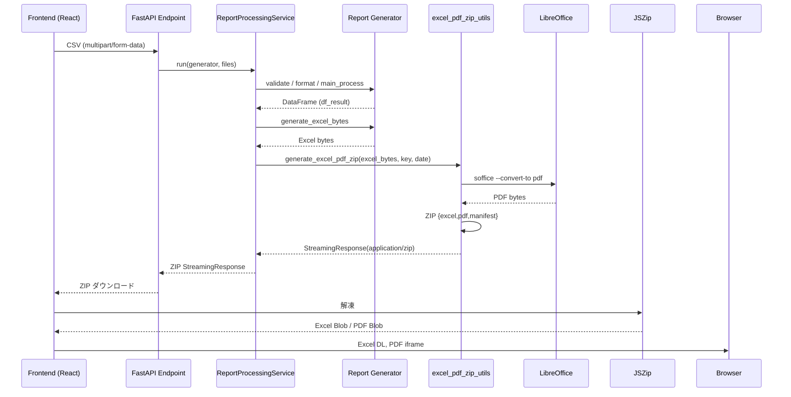

# 帳票配布方式移行提案（ZIP → URL）

## 0. 目的と背景
- **目的**: 帳票配布を ZIP 返却から Excel/PDF 個別の URL 返却へ移行し、利用者体験と運用耐性を向上させる。
- **背景課題**:
  - 大容量 ZIP のダウンロード/解凍に失敗する問い合わせが多く、スマートフォンやタブレットでは特に顕著。
  - `JSZip` を用いたブラウザ解凍がメモリを圧迫し、PDF プレビュー生成にも時間がかかる。
  - LibreOffice CLI による PDF 変換はプロセス競合が発生しやすく、ZIP 再生成リトライが不可視。

---

## 1. 現状把握

### 1.1 バックエンド主要モジュール
| 層 | ファイル/クラス | 役割 | 呼び出し元 |
| --- | --- | --- | --- |
| FastAPI ルーター | `app/api/endpoints/reports/*`<br>`block_unit_price_interactive.py` | CSV 受信 → サービス呼び出し | フロント `fetch()` |
| サービス層 | `ReportProcessingService`<br>`InteractiveReportProcessingService` | CSV 読込・検証・整形・`create_response` | 上記ルーター |
| ドメイン層 (Generator) | `app/api/services/report/concrete_generators.py` 各クラス | Excel バイト列生成 | サービス層 |
| 共通ユーティリティ | `excel_pdf_zip_utils.generate_excel_pdf_zip` | Excel→PDF 変換 + ZIP 作成 | サービス層 `create_response()`<br>`BlockUnitPriceInteractive.create_zip_response()` |
| LibreOffice 呼び出し | `convert_excel_to_pdf()` | 一時ディレクトリ + プロファイル生成、`soffice` 実行 | `generate_excel_pdf_zip()` |

### 1.2 フロントエンド主要モジュール
| 層 | ファイル/フック | 役割 | ZIP 依存点 |
| --- | --- | --- | --- |
| ビジネスロジック Hook | `hooks/report/useReportBaseBusiness.ts` | `useZipFileGeneration` を介して ZIP 取得・状態管理 | ✅ |
| データ Hook | `hooks/data/useZipFileGeneration.ts` | ZIP 受信 → JSZip で解凍 → Excel/PDF Blob 管理 | ✅ | 
| 見た目（例） | `pages/report/LedgerBookPage.tsx` 等 | Hook の状態を使いダウンロード/プレビュー UI | 間接依存 |

### 1.3 現行フロー（ZIP 配布）


---

## 2. 課題整理
1. **UX**: ZIP 解凍が必須・端末依存。PDF プレビューまでの待ち時間が長い。
2. **可観測性**: ZIP 内の `manifest.json` しかメタ情報がなく、失敗時リカバリーが難しい。
3. **運用**: LibreOffice プロファイル競合や一時ディレクトリ掃除の負荷。
4. **拡張性**: 個別ファイル配布（画像, CSV, JSON 等）追加時に ZIP 前提が足かせ。

---

## 3. 新方式の要求事項整理
- ZIP 廃止。Excel/PDF を個別 URL で返却。
- 保存先: `reports/{report_key}/{report_date}/{yyyyMMdd_HHmmss}-{rand8}/{file_base}.{xlsx|pdf}`
- Excel: ダウンロードリンク。PDF: iframe プレビュー URL。
- PDF 変換は高並列でも競合しない（専用プロファイル、プロセス監視、完了検証）。
- フロントは URL をそのまま扱い、JSZip 依存を削除。
- すべて SOLID/MVC に沿った責務分割と、初心者向けコメントをコードに付与。

---

## 4. 設計案

### 4.1 選択肢 A: **同期生成 + ローカル永続化 + 署名付き URL**
- **概要**: リクエストを同期処理のまま、生成後に `ReportArtifactStorage` サービスでローカル/共有ボリュームへ保存。FastAPI が `/api/reports/artifacts/{token}` で署名付き一時 URL を返す。
- **長所**
  - 既存フローを最小改修で踏襲（同期レスポンス）。
  - LibreOffice 実行完了後にファイル検証・保存が一度で済む。
  - 既存セッション管理を流用可能。
- **短所**
  - リクエストが長時間ブロック。大容量時に API タイムアウトの懸念。
  - アプリ Pod のローカルストレージを共有/バックアップする設計が必要。
- **影響範囲**
  - バックエンド: `excel_pdf_zip_utils` 廃止 → `artifact_service` 新設。
  - フロント: JSZip 依存削除、レスポンス JSON 仕様変更対応。
- **想定コスト**
  - バックエンド 4 人日 (サービス新設, 既存呼び出し調整, テスト)。
  - フロント 2 人日 (Hook 改修, UI 修正, E2E テスト)。

### 4.2 選択肢 B: **非同期ジョブ + オブジェクトストレージ (S3 互換)**
- **概要**: アップロード後すぐジョブ ID を返却。バックグラウンドワーカーが Excel/PDF を生成し、S3 に保存。完成後に Webhook or ポーリングで URL を通知。
- **長所**
  - 重い帳票でもリクエストタイムアウトなし。水平スケールが容易。
  - ストレージと API が疎結合。
- **短所**
  - キュー・ワーカー管理が必須 (Redis/Celery 等)。
  - 現行 UI/業務フローに大きな変更。
- **影響範囲**
  - バックエンド: キュー投入 API, ワーカー, 状態管理 DB。
  - フロント: ポーリング/通知 UI。
- **想定コスト**
  - バックエンド 10 人日 (ワーカー導入 + インフラ整備)。
  - フロント 4 人日 (状態管理・UX 追加)。

### 4.3 推奨
- 現行リリース計画では **選択肢 A** を推奨。同期 API である程度 UX が確保されており、ZIP を URL に置き換える最小ステップとして妥当。将来的なジョブ化はアーティファクト保存/配信の仕組みを流用しやすくなる。

---

## 5. バックエンド実装案（選択肢 A）

### 5.1 新サービスの構成
```text
app/
  backend/
    ledger_api/
      app/
        api/
          services/
            report/
              artifact_service.py   # 保存/署名URL発行を担当 (SOLID: 単一責務)
          utils/
            pdf_conversion.py       # LibreOffice 実行をユーティリティ化
```

### 5.2 クラス設計（SOLID コメント付き）
```python
# artifact_service.py
from dataclasses import dataclass
from pathlib import Path
import secrets
from fastapi.responses import JSONResponse

@dataclass(frozen=True)
class ArtifactLocation:
    # 👶 初学者向け: ここで保存先の最終パス (ディレクトリ + ファイル名) をまとめて保持します。
    base_dir: Path
    report_key: str
    report_date: str
    token: str  # yyyyMMdd_HHmmss-rand8 形式

    @property
    def directory(self) -> Path:
        """👶 ディレクトリパスを作る便利プロパティです。"""
        return self.base_dir / self.report_key / self.report_date / self.token

    def file_path(self, suffix: str) -> Path:
        """👶 Excel(.xlsx) や PDF(.pdf) のパスを組み立てます。"""
        return self.directory / f"artifact{suffix}"

class ReportArtifactStorage:
    """帳票ファイル保存と URL 発行を担当 (S: 単一責務, I: インターフェース分離)."""

    def __init__(self, base_dir: Path, url_signer: "UrlSigner") -> None:
        self.base_dir = base_dir
        self.url_signer = url_signer

    def allocate(self, report_key: str, report_date: str) -> ArtifactLocation:
        token = f"{datetime.now():%Y%m%d_%H%M%S}-{secrets.token_hex(4)}"
        location = ArtifactLocation(self.base_dir, report_key, report_date, token)
        location.directory.mkdir(parents=True, exist_ok=True)
        return location

    def save_excel(self, loc: ArtifactLocation, content: bytes) -> Path:
        path = loc.file_path(".xlsx")
        path.write_bytes(content)
        return path

    def save_pdf(self, loc: ArtifactLocation, content: bytes) -> Path:
        path = loc.file_path(".pdf")
        path.write_bytes(content)
        return path

    def build_payload(self, loc: ArtifactLocation) -> dict[str, str]:
        """👶 フロントに渡す URL をまとめて返します。"""
        excel_url = self.url_signer.create_download_url(loc.file_path(".xlsx"))
        pdf_url = self.url_signer.create_preview_url(loc.file_path(".pdf"))
        return {
            "excel_download_url": excel_url,
            "pdf_preview_url": pdf_url,
            "report_token": loc.token,
        }
```

### 5.3 PDF 変換ユーティリティ強化
- 一時ディレクトリではなく、`report_token` 配下の専用ディレクトリに LibreOffice プロファイルを作成し、競合を排除。
- プロセス完了チェック: 戻り値 + 生成ファイルヘッダー検証。失敗時は再試行し、ログに token を出力。

```python
# pdf_conversion.py
import subprocess
from pathlib import Path

class PdfConversionError(Exception):
    """👶 PDF 変換に失敗したときに投げるエラーです。"""

def convert_excel(excel_path: Path, output_dir: Path, profile_dir: Path) -> Path:
    """LibreOffice を呼び出して PDF を出力します。"""
    profile_dir.mkdir(parents=True, exist_ok=True)
    cmd = [
        "soffice", "--headless", "--nologo", "--nodefault", "--norestore",
        "--nolockcheck", "--convert-to", "pdf:calc_pdf_Export",
        f"-env:UserInstallation=file://{profile_dir.as_posix()}",
        "--outdir", str(output_dir), str(excel_path)
    ]
    result = subprocess.run(cmd, capture_output=True, text=True, timeout=120)
    if result.returncode != 0:
        raise PdfConversionError(result.stderr)
    pdf_path = output_dir / (excel_path.stem + ".pdf")
    data = pdf_path.read_bytes()
    if not data.startswith(b"%PDF-"):
        raise PdfConversionError("PDF header signature missing")
    return pdf_path
```

### 5.4 サービス層の変更ポイント
- `ReportProcessingService.create_response()` を以下の JSON 返却へ差し替え。
```json
{
  "status": "success",
  "report_key": "factory_report",
  "report_date": "2025-10-02",
  "artifact": {
    "excel_download_url": "/api/reports/artifacts/..",
    "pdf_preview_url": "/api/reports/artifacts/.../preview",
    "report_token": "20251002_153045-ab12cd34"
  },
  "summary": {
    "total_amount": 1234567,
    "total_transport_fee": 8901,
    "processed_records": 123
  }
}
```
- `StreamingResponse` → `JSONResponse` に変更。Excel/PDF は `ReportArtifactStorage` で保存。
- `BlockUnitPriceInteractive.create_zip_response()` を `create_artifact_payload()` へリネームし、同じ仕組みを利用。

### 5.5 API 追加
- `GET /api/reports/artifacts/{token}/{filename}`: ローカルファイルを `FileResponse` で返す。署名付き URL の署名期限を検証。PDF 用には `inline` Content-Disposition を設定。
- URL 署名インターフェースは単純な HMAC (secret) で実装し、期限切れ時は 404。

---

## 6. フロントエンド実装案

### 6.1 Hook 差し替え
- `useZipFileGeneration.ts` を `useReportArtifact.ts` にリネーム。
- fetch 後は JSON の `artifact` をセットするだけで完了。JSZip や Blob 管理を削除。

```typescript
// useReportArtifact.ts (抜粋)
export const useReportArtifact = () => {
  const [excelUrl, setExcelUrl] = useState<string | null>(null);
  const [pdfUrl, setPdfUrl] = useState<string | null>(null);

  const generateReport = useCallback(async (...) => {
    const response = await fetch(apiEndpoint, { method: 'POST', body: formData });
    const json = await response.json();
    setExcelUrl(json.artifact.excel_download_url);
    setPdfUrl(json.artifact.pdf_preview_url);
  }, []);

  return { excelUrl, pdfUrl, downloadExcel: () => window.open(excelUrl) };
};
```
- `useReportBaseBusiness.ts` での参照を更新し、PDF プレビューは iframe の `src` に直指定。

### 6.2 UI 更新
- ダウンロード/プレビューのトリガーを URL クリックに変更。Blob ダウンロードが不要になるためボタン文言も「ダウンロード開始」→「Excel を開く」に整理。
- PDF iframe:
```tsx
<iframe
  title="PDF プレビュー"
  src={artifact.pdfUrl ?? ''}
  style={{ width: '100%', height: '80vh', border: 'none' }}
/>
```

### 6.3 依存ライブラリ整理
- `package.json` から `jszip` 削除。
- IE11 向け Polyfill (不要なら) をクリーンアップ。

---

## 7. 最小差分 PR 案
| Commit 順 | タイトル | 主な変更 | ロールバック方法 |
| --- | --- | --- | --- |
| 1 | chore: introduce report artifact storage service | 新クラス追加 (`artifact_service.py`, `pdf_conversion.py`) | ファイル削除で元に戻る |
| 2 | refactor: replace ZIP response with artifact payload | `ReportProcessingService` / `InteractiveReportProcessingService` のレスポンス変更、`excel_pdf_zip_utils` の使用箇所削除 | git revert commit; `excel_pdf_zip_utils` を復活 |
| 3 | feat: add artifact download endpoint with signed URL | FastAPI ルーター追加、署名検証 | エンドポイント削除, 署名キー無効化 |
| 4 | feat: update frontend hooks to consume artifact URLs | `useReportBaseBusiness.ts` / 新 Hook / コンポーネント更新 | git revert, JSZip フローへ戻す |
| 5 | chore: remove legacy ZIP utilities | 未使用ファイル削除・`package.json` 更新 | git revert で復活 |

- 各コミットには `Rollback:` セクションを PR 説明文に明記。

---

## 8. 受け入れ基準と検証手順
| No | 観点 | 観測手順 | 担当 |
| --- | --- | --- | --- |
| 1 | Excel ダウンロード | フロントから帳票生成 → Excel URL をクリック → 正常に XLSX がダウンロードされる | 現場担当 (操作) |
| 2 | PDF プレビュー | 同上 → iframe に PDF が表示される | QA |
| 3 | URL 期限切れ | 署名期限を 1 分に設定 → 期限超過後 403/404 を確認 | QA |
| 4 | 並列負荷 | 5 並列で帳票生成 → ログに競合エラーが出ないこと | SRE |
| 5 | API 応答 | `curl` で JSON 取得 → `artifact` フィールド構造が期待通り | BE エンジニア |

- 自動テスト: `pytest` で `artifact_service` の保存/署名テスト, React テストで Hook の返却値確認。

---

## 9. ロールバック計画
1. `git revert` でコミット 4 → 3 → 2 → 1 を順に戻す（状態整合性を保つため逆順）。
2. `excel_pdf_zip_utils` / `useZipFileGeneration` を復帰。
3. インフラ: `reports/` ディレクトリ掃除、署名キー破棄。
4. リリースノートで ZIP 方式へ戻した旨を案内。

---

## 10. 次のステップ（任意改善）
- 選択肢 B (非同期ジョブ) への発展: 今回導入する `ReportArtifactStorage` をワーカーから再利用可能。
- 生成ファイルを S3 互換ストレージへ同期するバッチを追加し、永続性向上。
- LibreOffice 実行をコンテナ化し、PDF 変換の責務を分離 (Sidecar 方式)。

---

## 11. まとめ
- ZIP 依存を排除し、Excel/PDF を URL 返却する案を現行コードベースに沿って整理。
- バックエンドは SOLID 原則で責務分割し、競合に強い PDF 変換ユーティリティへ刷新。
- フロントはシンプルな URL 消費フローへ移行し、端末負荷を軽減。
- 最小差分 PR とロールバック手順を用意し、現場レビューに耐えうる提案を提供した。