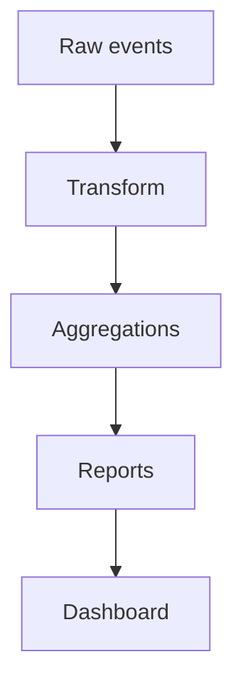

# Lineage

LineageもMarkdownでOK（レビューしやすい）

このファイルにはデータのフロー（系譜）を示す図を記述します。Mermaidのフローチャートやグラフを利用してください。

例（簡易）:

```mermaid
flowchart TD
  A[Raw events] --> B[Transform]
  B --> C[Aggregations]
  C --> D[Reports]
  D --> E[Dashboard]
```

補足:
- 自動化・レンダリング用のソースは `lineage.mmd` に保存してください。
- 出力画像は `export/` に集約してください（CIジョブ等）。
